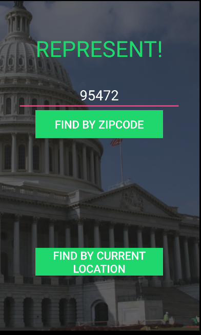

# PROG 02: Represent!

Represent! is an app for anyone to find out who their representatives and senators are based on a zipcode or their current location.

## Authors
Akkshay Khoslaa ([akhoslaa@berkeley.edu](mailto:akhoslaa@berkeley.edu))

## Demo Video

See [Represent! App Demo] (https://youtu.be/jlPtXkcSyEg)

## Screenshots

## Acknowledgments

* CircleImageView Library (de.hdodenhof:circleimageview:2.0.0)
* Picasso Library (com.squareup.picasso:picasso:2.5.2)
